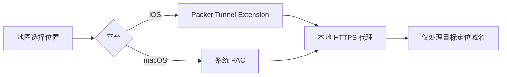

<p align="center">
  
</p>

<h1 align="center">OpenHRTT WLoc</h1> <a href="README_EN.md">English</a>

<h4>


<p>网页定位支持到iOS27.0 beta5， 27.0 beta6以后的版本由于苹果封堵暂不能使用，在线体验：<a href="https://wloc8.com/" target="_blank">https://wloc8.com/</a>，TG群：https://t.me/wloc88</p>
如您有Mac电脑，请加入群聊进行兼容性测试：https://t.me/wloc88</h4>

## 项目介绍

OpenHRTT WLoc 是一个完全开源、使用 Swift 编写的 iOS/macOS 实验性工具。通过更改gs-loc接口请求响应达到更改设备真实位置的目的，支持最新iOS及MacOS系统，。

## 工作原理



代理目前只针对 `gs-loc.apple.com` 和 `gs-loc-cn.apple.com`，不应被当作通用 VPN 或通用 HTTPS 抓包工具。

## 快速开始

### 1. 获取代码并安装依赖

```bash
git clone https://github.com/OpenHRTT/wloc.git
cd wloc
pod install
```

使用 `WLocApp-macOS` Scheme 执行 Debug Run 时，Scheme 会在构建完成后自动把已签名 App 安装到 `/Applications/WLoc8.com.app`，并从该路径启动调试。当前 Xcode 用户需要有 `/Applications` 写权限；如只想构建而不安装，可在环境中设置 `WLOC_SKIP_DEBUG_INSTALL=1`。

### 2. 生成你自己的本地证书

仓库不包含任何可重用的根证书私钥或 `.p12` 文件。每个开发者都必须在本机生成独立证书：

```bash
chmod +x generate_apple_wloc_p12.sh
./generate_apple_wloc_p12.sh
```

脚本会生成证书并自动同步到 App/Extension 资源目录。默认 `.p12` 密码为 `app-wloc`，与 `AppWLocConfig.proxyIdentityPassword` 一致。如果你修改脚本密码，也必须同步修改应用配置。

### 3. 配置Bundle Identifier

然后修改 Bundle Identifier，并保证 Tunnel 的标识为应用标识加 `.tunnel`。例如：

```text
com.example.wloc
com.example.wloc.tunnel
```

App Group 只用于 iOS 主应用和 Tunnel 共享状态。请将下列文件中的 `group.com.wlocapp.shared` 统一替换为你的 App Group：

- `Resources/iOS/WLocApp-iOS.entitlements`
- `Resources/Tunnel/WLocTunnel-iOS.entitlements`
- `WLocApp/WLocCore/AppWLocConfig.swift`


## 外部链接（待开发）

应用支持通过 `wlocapp://` 导入位置。载荷是 URL 编码后的 JSON：

```json
{
  "type": "location",
  "data": {
    "name": "Tiananmen Square",
    "detail": "Beijing",
    "latitude": 39.9087,
    "longitude": 116.3975,
    "coordinateSystem": "wgs84"
  }
}
```

支持的 `coordinateSystem` 值包括 `wgs84`、`gcj02`、`bd09` 和 `apple`。完整 URL 可以使用两种格式：

```text
wlocapp://<percent-encoded-json>
wlocapp://?payload=<percent-encoded-json>
```


## 常见问题

**构建时提示找不到 `AppWLocProxy.p12` 或 `AppWLocRootCA.cer`？**

在项目根目录运行 `./generate_apple_wloc_p12.sh`。

**Signing 或 App Group 报错？**

确认四个 Target 都选择了正确的 Team，并且 iOS App 与 Tunnel 使用同一个 App Group。

**点击锁定后没有生效？**

检查根证书是否已安装且完全信任。iOS 还需确认 VPN 已连接；macOS 需确认系统“自动代理配置”已指向本机 PAC，然后按 App 提示刷新定位服务。

更多排查步骤见 [docs/TROUBLESHOOTING.md](docs/TROUBLESHOOTING.md)。

## 许可证

本项目自有代码使用 [MIT License](LICENSE)。第三方代码不受本项目 MIT License 覆盖，具体见 [NOTICE](NOTICE) 和 [THIRD_PARTY_NOTICES.md](THIRD_PARTY_NOTICES.md)。
