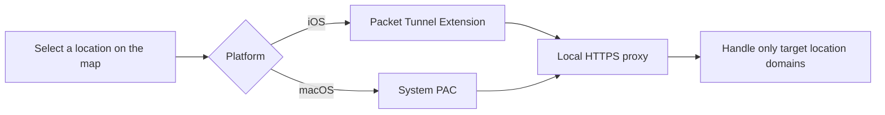

<p align="center">
  
</p>

<h1 align="center">OpenHRTT WLoc</h1> <a href="README.md">中文</a>

<h4>


<p>Web-based location supports iOS 27.0. Try it online: <a href="https://wloc8.com/" target="_blank">https://wloc8.com/</a>. Telegram group: https://t.me/wloc88</p>
If you have a Mac, please join the group for compatibility testing: https://t.me/wloc88</h4>

## Project Overview

OpenHRTT WLoc is a fully open-source experimental tool for iOS and macOS written in Swift. It changes the device's actual location by modifying responses to `gs-loc` API requests and supports the latest iOS and macOS versions.

## How It Works



The proxy currently targets only `gs-loc.apple.com` and `gs-loc-cn.apple.com`. It should not be treated as a general-purpose VPN or HTTPS traffic interception tool.

## Quick Start

### 1. Get the Code and Install Dependencies

```bash
git clone https://github.com/OpenHRTT/wloc.git
cd wloc
pod install
```

When you perform a Debug Run using the `WLocApp-macOS` scheme, the scheme automatically installs the signed app to `/Applications/WLoc8.com.app` after the build completes and launches debugging from that path. The current Xcode user needs write access to `/Applications`. If you only want to build without installing, set `WLOC_SKIP_DEBUG_INSTALL=1` in the environment.

### 2. Generate Your Own Local Certificates

The repository does not include any reusable root certificate private keys or `.p12` files. Each developer must generate an independent certificate locally:

```bash
chmod +x generate_apple_wloc_p12.sh
./generate_apple_wloc_p12.sh
```

The script generates the certificates and automatically copies them to the App and Extension resource directories. The default `.p12` password is `app-wloc`, which matches `AppWLocConfig.proxyIdentityPassword`. If you change the password in the script, you must also update the app configuration.

### 3. Configure Bundle Identifiers

Next, change the Bundle Identifiers and make sure the Tunnel identifier is the app identifier followed by `.tunnel`. For example:

```text
com.example.wloc
com.example.wloc.tunnel
```

The App Group is used only to share state between the iOS app and the Tunnel. Replace `group.com.wlocapp.shared` consistently with your App Group in the following files:

- `Resources/iOS/WLocApp-iOS.entitlements`
- `Resources/Tunnel/WLocTunnel-iOS.entitlements`
- `WLocApp/WLocCore/AppWLocConfig.swift`


## External Links (Under Development)

The app supports importing locations through `wlocapp://`. The payload is URL-encoded JSON:

```json
{
  "type": "location",
  "data": {
    "name": "Tiananmen Square",
    "detail": "Beijing",
    "latitude": 39.9087,
    "longitude": 116.3975,
    "coordinateSystem": "wgs84"
  }
}
```

Supported `coordinateSystem` values include `wgs84`, `gcj02`, `bd09`, and `apple`. A complete URL can use either of the following formats:

```text
wlocapp://<percent-encoded-json>
wlocapp://?payload=<percent-encoded-json>
```


## FAQ

**The build cannot find `AppWLocProxy.p12` or `AppWLocRootCA.cer`. What should I do?**

Run `./generate_apple_wloc_p12.sh` from the project root.

**Signing or App Group errors?**

Make sure all four targets use the correct Team and that the iOS App and Tunnel use the same App Group.

**Locking a location does not take effect?**

Check that the root certificate is installed and fully trusted. On iOS, also make sure the VPN is connected. On macOS, make sure the system's Automatic Proxy Configuration points to the local PAC, then refresh Location Services as instructed by the app.

For more troubleshooting steps, see [docs/TROUBLESHOOTING.md](docs/TROUBLESHOOTING.md).

## License

Code owned by this project is licensed under the [MIT License](LICENSE). Third-party code is not covered by this project's MIT License. See [NOTICE](NOTICE) and [THIRD_PARTY_NOTICES.md](THIRD_PARTY_NOTICES.md) for details.
